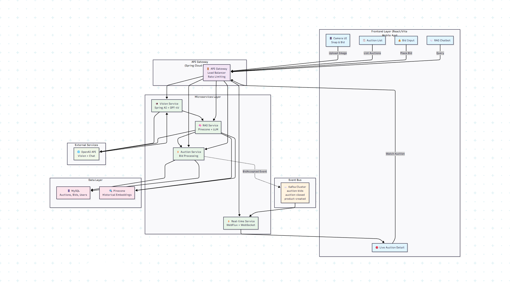

# FishOnBid: Distributed Intelligence Auction Platform

FishOnBid is a high-performance, event-driven marketplace designed to empower rural fishing communities. It transitions a traditional monolithic auction process into a scalable, AI-powered distributed system. By leveraging Computer Vision and Retrieval-Augmented Generation (RAG), the platform allows fishermen to list catches in seconds while ensuring fair market pricing for buyers.

## 🏗 System Architecture

The platform follows a **Microservices Pattern** to ensure high availability and independent scaling:



* **API Gateway (Spring Cloud):** Central entry point for routing traffic, load balancing, and rate limiting.
* **Vision Service:** Multimodal AI (Spring AI + GPT-4V) that extracts species, weight, and freshness indicators from photos.
* **Auction Service:** Manages core bidding logic, validation, and real-time auction state.
* **RAG Service:** Uses Pinecone and historical auction embeddings to provide intelligent market insights and pricing trends.
* **Real-Time Service:** Reactive WebFlux service pushing live bid updates to connected buyers via WebSockets.
* **Event Bus (Kafka):** Decouples the "fast path" (bid acceptance) from "slow path" notifications to handle high-concurrency spikes.

---

## 🚀 Project Vision

Traditional fish auctions suffer from manual entry bottlenecks and a lack of data-driven pricing. FishOnBid solves this through:

* **Accessibility:** "Snap & Bid" allows users to list products via AI image analysis, reducing listing friction from minutes to seconds.
* **Scalability:** An event-driven architecture capable of handling 10,000+ concurrent bids during peak landing hours.
* **Intelligence:** RAG-powered insights provide real-time market trends to help fishermen and buyers make data-driven decisions.

---

## 🛠 Tech Stack

### Core Infrastructure
* **Backend:** Spring Boot 3.x (Java 21).
* **Frontend:** React JS with Bootstrap 5 (Mobile-optimized).
* **Database:** MySQL (Relational persistence with Pessimistic Locking).
* **Security:** Stateless JWT-based Authentication.

### Advanced Distributed Layer (In-Progress)
* **Message Broker:** Apache Kafka for decoupled bidding events.
* **AI Integration:** Spring AI with OpenAI GPT-4 Vision.
* **Vector Store:** Pinecone for historical auction embeddings (RAG).
* **Orchestration:** Docker & Kubernetes (EKS/AKS).

---

## 📅 Roadmap & Milestones

### ✅ Phase 1: Foundation (Completed)
* Established Spring Boot & React core structure.
* Implemented JWT Security & User Authentication.
* Developed core bidding engine with Pessimistic Locking to prevent race conditions.
* Built Auction Summary & Winner Selection logic.

### 🏗 Phase 2: AI & UX (Current)
* **Snap & Bid:** Integration of Spring AI for automated listing generation.
* **RAG Pipeline:** Indexing historical auction data into Pinecone for price suggestions.
* **UI/UX Polish:** Mobile-first responsive design for coastal environments.

### 🚀 Phase 3: Scaling & Real-Time (Upcoming)
* Migration to Apache Kafka for event-driven bid processing.
* WebSocket implementation via Spring WebFlux for sub-500ms updates.
* Load testing for 10,000+ concurrent transactions.

---

## 📈 Performance Targets

| Key Performance Metric | Target Goal |
| :--- | :--- |
| **Bid Processing Latency (p50)** | < 100ms |
| **Live Notification Delay** | < 500ms |
| **Max Concurrent Transactions** | 10,000+ bids per second |
| **Average Listing Creation Time** | 30 seconds (via Snap & Bid) |
| **Species Identification Accuracy** | > 95% |

---

## 🔧 Installation & Setup

### Prerequisites
* Java 21 (Migrated via OpenRewrite)
* Node.js & npm
* MySQL 8.0+
* Maven

### Running the Project
```bash
# Clone the repository
git clone [https://github.com/Vivin204Antony/FishOnBid.git](https://github.com/Vivin204Antony/FishOnBid.git)

# Backend Setup
cd FishOnBid-Backend
./mvnw spring-boot:run

# Frontend Setup
cd FishOnBid-Frontend
npm install
npm run dev
