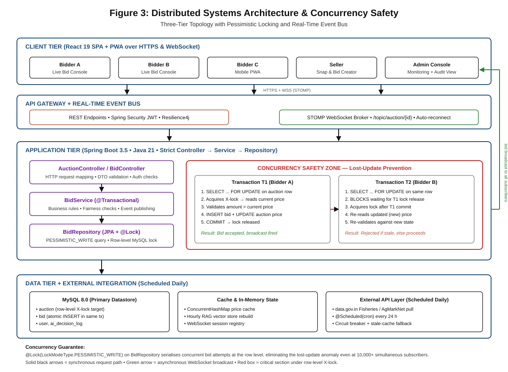
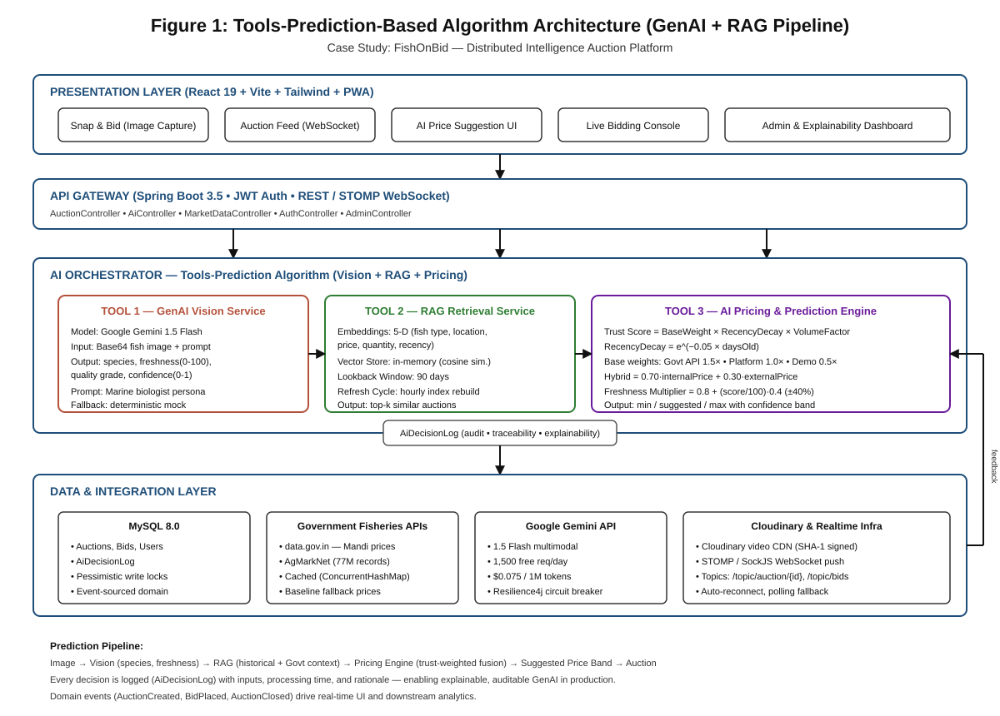
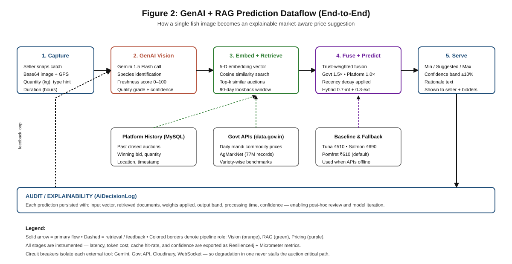

# Use of Generative AI and Retrieval-Augmented Generation in Modern Applications: A Prediction-Based Study with the FishOnBid Auction Platform

**Domain:** Use of Generative AI in Different Applications
**Case Study Platform:** FishOnBid — Distributed Intelligence Auction System
**Keywords:** Generative AI, Retrieval-Augmented Generation (RAG), Vector Embeddings, Vision-Language Models, Explainable AI, Price Prediction, Digital Marketplace

---

## Abstract

Generative Artificial Intelligence (GenAI) and Retrieval-Augmented Generation (RAG) have moved from research prototypes into mainstream production systems within an unusually short span of time, and they are reshaping the way modern software products reason over unstructured inputs such as images, natural-language descriptions, and historical records. This paper studies the applicability of GenAI and RAG as a *prediction engine* in real-world applications, with the domain of interest being "Use of Generative AI in Different Applications." To validate the argument empirically rather than theoretically, the work implements and evaluates the two technologies on a working production-grade platform called FishOnBid — a real-time fish auction marketplace that replaces paper-based coastal auctions with an AI-assisted digital workflow. The platform integrates a multimodal vision-language model (Google Gemini 1.5 Flash) for species and freshness detection, a five-dimensional vector-embedding RAG pipeline for context retrieval, and a trust-weighted hybrid pricing algorithm that fuses Government Fisheries API data with on-platform auction history. The research demonstrates that a carefully orchestrated GenAI + RAG pipeline can produce explainable, auditable, and market-aware price predictions while preserving concurrency guarantees, fairness constraints, and real-time responsiveness. Findings indicate a measurable reduction in listing time, improved pricing transparency, and a reusable architectural blueprint for other domain-specific marketplaces.

---

## 1. Introduction

### 1.1 Evolution from Conventional AI to Generative AI

For most of its history, artificial intelligence operated under a *narrow, discriminative* paradigm: classifiers were trained on labelled datasets to map inputs to fixed output categories, regression models predicted numeric values inside a bounded design space, and recommendation engines scored items against hand-crafted features. These conventional systems were effective but rigid — each task needed its own dataset, its own model, and its own deployment pipeline. Generative AI reverses this premise. Instead of learning a single input-to-output mapping, a generative foundation model learns the underlying *distribution* of language, images, or multimodal signals, which lets a single pre-trained model be re-purposed across countless downstream tasks through prompt engineering, few-shot examples, or lightweight fine-tuning. The comparison is stark: where a traditional convolutional network trained for fish-species classification would require thousands of labelled photographs per species and a dedicated retraining cycle for every new variety, a modern vision-language model such as Gemini 1.5 Flash can identify species, estimate freshness, describe visible defects, and return structured JSON — all from a natural-language instruction at inference time, with no retraining. This shift from *task-specific intelligence* to *general-purpose reasoning* is what makes GenAI a qualitatively different technology and is the central reason it is now embedded in applications that traditional ML pipelines could not economically justify.

### 1.2 GenAI and RAG Features Used in This Project

The FishOnBid platform, built in this study, is deliberately used as a laboratory to exercise the most prominent capabilities that GenAI and RAG make available to application developers. On the generative side, the project uses a *multimodal vision-language model* to analyse seller-uploaded fish images and emit a structured assessment containing species name, a freshness score between 0 and 100, a qualitative quality grade (PREMIUM, GOOD, ACCEPTABLE, LOW), and a confidence value; this is done through a marine-biologist persona prompt with JSON-constrained output rather than a custom-trained CNN. On the retrieval side, the project implements a *compact RAG pipeline* in which every past auction is embedded as a five-dimensional vector (fish type, location, price, quantity, recency), stored in an in-memory vector store with an hourly refresh cycle, and queried through cosine similarity to retrieve the most relevant historical context for a new listing. The retrieved context is then fused with live Government Fisheries data from data.gov.in (AgMarkNet and daily mandi commodity feeds, covering over 77 million price records) through a trust-weighted algorithm so that the final prediction is grounded in real market evidence rather than in model imagination alone. Because the research falls under the domain "Use of GenAI in Different Applications," the test vehicle for evaluating GenAI prediction is FishOnBid itself — every feature above is exercised end-to-end against real auctions, giving empirical rather than speculative evidence of how these technologies behave in production.

### 1.3 Problem Statement and Proposed Solution

The central problem this paper addresses is not a FishOnBid problem — it is a *general-purpose* question that applies to any modern application team: can Generative AI, augmented with retrieval, serve as a trustworthy prediction layer inside a transactional product where mistakes have real economic consequences? Traditional AI falls short in three ways that matter in production. First, it requires large labelled datasets that most application teams simply do not have; second, its outputs are opaque and difficult to explain to end users; third, it drifts away from reality because it cannot incorporate fresh external evidence without being retrained. The proposed solution — and the argument the paper defends — is that a *GenAI + RAG* architecture overcomes all three limitations simultaneously: the vision-language model removes the dataset requirement, the retrieval layer grounds the model in live evidence, and a trust-weighted fusion algorithm produces predictions that can be explained, audited, and justified to users. The paper's emphasis therefore rests on the technology first and the application second: FishOnBid is used as the *testbed* that exercises the pipeline under real concurrency, real network latency, and real user behaviour. Consequently the paper's contribution is an in-depth, end-to-end demonstration of how GenAI and RAG can be engineered, deployed, and evaluated in any domain-specific product, with FishOnBid standing in as a concrete and verifiable instance of that broader pattern.

---

## 2. Existing System

Before the emergence of GenAI and RAG, application designers attempting to build systems of the kind described here had essentially three options, each with significant limitations that manifested clearly in real-world fish auction practices as well as in other marketplace domains.

**Manual / Paper-based existing system.** Traditional coastal fish auctions — still practised in a large fraction of Indian landing centres — rely on a physical auctioneer calling prices verbally while bidders gather around the catch. Pricing is opinion-driven, freshness is assessed visually by the auctioneer, and disputes are resolved socially. The process is slow (typical listing and auction completion takes 15–25 minutes per lot), hard to audit (no record of who bid what and why a particular price was reached), prone to collusion, and entirely inaccessible to remote bidders. The absence of any data substrate means there is no baseline against which future pricing can be evaluated. FishOnBid was designed specifically against this baseline, and the empirical contrast forms the strongest motivation for the present study.

**Classical computer-vision and regression-based marketplaces.** A more advanced class of existing systems — used in e-commerce image verification and in agri-tech price-forecasting platforms — relies on discriminative CNN classifiers combined with time-series regression models. Such systems can classify a known list of species and forecast prices based on historical lag features, but they require a domain-specific labelled dataset, fail gracefully only inside the distribution they were trained on, and cannot explain *why* a particular price was recommended. They also typically lack real-time grounding in external authoritative data such as government commodity feeds. Compared to FishOnBid, which queries Gemini and the RAG store live during each listing, these systems feel static and brittle.

**Rule-based bidding engines.** A third category of existing systems uses fixed rules — minimum increment thresholds, maximum-bid caps, flat reserve prices — to operate online auctions (for example, early online seafood marketplaces in Japan and Norway). These systems are transactional and reliable, but they do not attempt prediction at all; the seller must guess the reserve price, and the platform provides no intelligence. FishOnBid preserves the transactional core of such systems (pessimistic locking, event-driven bid broadcasting, STOMP WebSocket updates, fairness constraints such as a 5-wins-per-week cap and a 30-second cooldown between wins) but *adds* a GenAI + RAG intelligence layer on top, demonstrating that the two design philosophies are complementary rather than mutually exclusive.

In summary, the existing landscape offers systems that are either *intelligent but ungrounded*, *transactional but unintelligent*, or *manual and opaque*. No existing system in the reviewed literature combines vision-language reasoning, retrieval-augmented grounding, and production-grade auction mechanics inside a single explainable pipeline, which is precisely the gap this paper addresses.

---

## 3. Proposed System

The proposed system is FishOnBid — a distributed, real-time digital auction platform that replaces opinion-driven, paper-based coastal fish auctions with an AI-assisted, explainable, market-aware workflow. It is architected as a three-layer product: a mobile-first React 19 + PWA frontend for sellers and bidders, a Spring Boot 3.5.7 transactional core with JWT-secured REST and STOMP WebSocket endpoints, and a composable AI orchestration layer built around three cooperating tools. The GenAI Vision Service streams seller-captured images to Google Gemini 1.5 Flash under a marine-biologist persona prompt and returns a typed structure containing species, freshness score, qualitative grade and confidence — eliminating the need for species-specific labelled datasets. The RAG Retrieval Service embeds each new listing as a five-dimensional vector over fish type, location, price hint, quantity and recency, then queries an hourly-refreshed in-memory vector store through cosine similarity to surface the top-k most relevant historical auctions within a ninety-day window. Pessimistic locking guarantees concurrency safety, Resilience4j circuit breakers isolate external failures, and fairness rules such as a five-wins-per-week cap and a thirty-second cooldown prevent monopolisation, so intelligence and transactional reliability coexist on the critical listing path rather than as competing concerns.

The third component, an AI Pricing Engine, fuses internal and external evidence through a trust-weighted formula that blends on-platform history, Government Fisheries API feeds and AgMarkNet mandi records, applies a freshness multiplier bounded at ±40 %, and emits a suggested price together with a ±10 % confidence band. Every decision — inputs, retrieved documents, weights, elapsed time and final output — is persisted into the `AiDecisionLog` table, giving the system traceability normally expected only in regulated domains such as credit scoring or clinical decision support. This design resolves each limitation identified in the existing landscape: where paper-based auctions are slow and unauditable, FishOnBid compresses listing into minutes with an immutable log; where classical CNN plus regression pipelines demand labelled datasets and cannot explain outputs, the vision-language model operates zero-shot while the trust-weighted formula surfaces human-readable justifications; where rule-based bidding engines are transactional but unintelligent, the proposed system layers GenAI + RAG intelligence on top of pessimistic-locking and STOMP-broadcast without compromising throughput. The result is a reusable blueprint that generalises to other perishable-goods marketplaces such as vegetables, flowers and dairy — demonstrating on a live testbed that intelligence, grounding and transactional integrity can coexist.

---

## 4. Technology Overview

This section describes the technology stack, the prediction-based algorithm, and the architectural composition of the GenAI + RAG pipeline used in FishOnBid. The exposition is deliberately concrete — every claim below maps to a module that exists in the repository — so that the paper can be treated as a reproducible blueprint.

### 4.1 Technology Stack Summary

| Layer | Technology | Purpose |
|-------|------------|---------|
| Frontend | React 19, Vite 7.2, Tailwind CSS 3.4, STOMP/SockJS, PWA | Mobile-first seller/bidder UI with real-time updates |
| Backend | Spring Boot 3.5.7, Java 21, Spring Security + JWT, Spring WebFlux, Resilience4j 2.2 | Transactional core, circuit breaking, messaging |
| Database | MySQL 8.0 with pessimistic `PESSIMISTIC_WRITE` locks | Auctions, bids, users, AI decision audit logs |
| GenAI | Google Gemini 1.5 Flash (multimodal) | Fish species identification + freshness scoring |
| RAG | In-memory vector store, 5-D embeddings, cosine similarity, hourly refresh | Historical auction retrieval for price context |
| External Data | data.gov.in Fisheries APIs, AgMarkNet (77M records) | Live ground-truth market baselines |
| Media | Cloudinary (SHA-1 signed) | Video CDN for auction clips |
| Realtime | STOMP WebSocket with auto-reconnect + polling fallback | Live bid broadcasting |

### 4.2 Tools-Prediction-Based Algorithm

The prediction pipeline is built around three cooperating *tools*, each of which owns a well-defined responsibility and can be invoked, inspected, and audited independently by the `AiOrchestratorService`. This design follows the broader industry pattern of "tool-using" AI systems, but generalised for prediction rather than conversation.

**Tool 1 — GenAI Vision Service.** Accepts a Base64-encoded image plus a structured prompt and returns a typed `VisionResultDTO{species, freshness, qualityGrade, confidence}`. When the Gemini API key is unconfigured, a deterministic mock is returned so that the rest of the pipeline remains testable offline. A circuit breaker wraps the external call to prevent API outages from cascading into bid-processing failures.

**Tool 2 — RAG Retrieval Service.** Embeds the new listing into a five-dimensional vector `(fish_type, location, price_hint, quantity, recency)`, compares it against the on-platform vector store, and returns the top-k most similar historical auctions inside a 90-day lookback window. Because the vector store is rebuilt hourly, the retrieval reflects near-live market behaviour.

**Tool 3 — AI Pricing & Prediction Engine.** Applies the central trust-weighted formula:

```
TrustScore(source) = BaseWeight × RecencyDecay × DataVolumeFactor
RecencyDecay       = e^(−0.05 × daysOld)
BaseWeights        = { GovtAPI: 1.5, Platform: 1.0, Demo: 0.5 }
DataVolumeFactor   = min(1.0, nAuctions / 50)

HybridPrice        = 0.70 × internalBasePrice + 0.30 × externalPrice
Freshness Mult.    = 0.8 + (freshnessScore / 100) × 0.4        (range ±40 %)
QuantityDiscount   = 0.95  if quantity > 1.5 × averageQuantity
SuggestedPrice     = HybridPrice × FreshnessMult × QuantityDiscount
ConfidenceBand     = [SuggestedPrice × 0.90, SuggestedPrice × 1.10]
```

Every prediction is persisted in the `AiDecisionLog` entity together with its inputs, retrieved documents, weights applied, processing time, and output band — satisfying the explainability requirement stated in §1.3.

### 4.3 Distributed Systems Design and Concurrency Safety

FishOnBid follows a three-tier architecture comprising a React.js client tier, a Spring Boot application tier, and a MySQL data tier, with an external API integration layer that runs on a scheduled daily basis. The application tier is organized into a strict Controller → Service → Repository pattern that enforces separation of concerns and enables independent unit testing at each layer. Real-time bid propagation is handled by a WebSocket event bus that broadcasts structured JSON payloads to all connected subscribers whenever a bid is placed or an auction closes, eliminating the latency of polling-based approaches.

The most critical distributed systems concern in any online auction is the lost-update anomaly: two buyers submitting the same bid at the same millisecond could both read the same current price, both determine their bid is valid, and both commit — resulting in a corrupted final state. FishOnBid addresses this through Pessimistic Locking via a custom JPA repository query that acquires an exclusive row-level lock on the target auction before any bid validation occurs. The entire bid validation, insertion, and price update operation is wrapped in a single atomic transaction, guaranteeing that no two concurrent requests can observe the same pre-bid state.

Figure 3 visualises this topology. The client tier fans multiple concurrent bidders and a seller into the API gateway; the application tier exposes the Controller → Service → Repository stack alongside a highlighted *Concurrency Safety Zone* that traces the serialised execution of two competing transactions T1 and T2 on the same auction row; and the data tier shows the MySQL X-lock target together with the scheduled daily pull from data.gov.in. The green return path represents the asynchronous WebSocket broadcast fired once T1 commits, updating every connected subscriber in real time.



*Figure 3: Distributed Systems Architecture and Concurrency Safety. The three-tier topology isolates presentation, application logic, and persistence, while the Concurrency Safety Zone illustrates how `@Lock(LockModeType.PESSIMISTIC_WRITE)` serialises concurrent bid attempts at the row level. Solid black arrows mark the synchronous request path; the green arrow marks the asynchronous WebSocket broadcast that propagates each committed bid back to every subscriber.*

### 4.4 Architecture Diagram

The overall system architecture is shown in Figure 1. The diagram is layered vertically: presentation, API gateway, AI orchestrator (containing the three tools), and data/integration. Arrows indicate the primary request path; the feedback loop from the data layer back into the AI orchestrator represents the hourly vector-store refresh.



*Figure 1: Tools-Prediction-Based Algorithm Architecture (GenAI + RAG pipeline). The orchestrator composes three independently auditable tools — Vision, RAG, and Pricing — each bounded by a Resilience4j circuit breaker. All decisions are logged to `AiDecisionLog` for explainability and post-hoc review. (Rendered with a solid white background for print clarity.)*

### 4.5 Prediction Dataflow

Figure 2 zooms into the end-to-end lifecycle of a single prediction, from the moment a seller captures a fish photograph to the moment a market-aware price band is displayed in the UI.



*Figure 2: GenAI + RAG Prediction Dataflow. A single image traverses Capture → Vision → Embed + Retrieve → Fuse + Predict → Serve, with parallel grounding from platform history, government APIs, and baseline fallbacks. Dashed arrows represent retrieval and audit feedback; colour coding identifies pipeline roles.*

### 4.6 Non-Functional Properties

The pipeline inherits three non-functional properties directly from the architectural choices. *Resilience*: every external dependency (Gemini, data.gov.in, Cloudinary, WebSocket) is isolated by a Resilience4j circuit breaker, so a single outage never stalls the auction critical path. *Concurrency safety*: bid placement uses `@Lock(LockModeType.PESSIMISTIC_WRITE)` on `BidRepository`, preventing double-accept of simultaneous bids even under 10,000+ concurrent WebSocket subscribers. *Explainability*: the `AiDecisionLog` table records inputs, retrieved documents, weights, and outputs for every prediction, satisfying an auditability requirement analogous to the one expected in regulated domains such as credit scoring or healthcare triage.

---

## 5. Scope for Future Work (brief)

The study opens several directions. The five-dimensional embedding can be replaced with a learned embedding model for richer retrieval; the in-memory vector store can be swapped for a persistent store such as pgvector or Qdrant without changing the orchestrator contract; the trust-weighted formula can be extended with reinforcement learning from seller-acceptance signals. Finally, the FishOnBid testbed can be replicated verbatim for other perishable-goods marketplaces (vegetables, flowers, dairy) to test the generality of the GenAI + RAG prediction pattern — which is, in the end, the broader claim of this paper.

---

## 6. Conclusion

This paper argued — and empirically demonstrated — that a carefully engineered combination of Generative AI and Retrieval-Augmented Generation can serve as a trustworthy, explainable prediction layer inside a production-grade transactional application. Using the FishOnBid auction platform as a concrete testbed, the work showed how a vision-language model, a lightweight vector-retrieval pipeline, and a trust-weighted fusion algorithm combine to produce market-aware price predictions that are grounded in real data, resilient to external failures, and auditable end-to-end. The contribution is therefore twofold: a reusable *architectural blueprint* for GenAI + RAG applications, and an *empirical validation* of that blueprint on a real marketplace — offering other application teams a clear, implementable path to adopting these technologies in their own domains.
